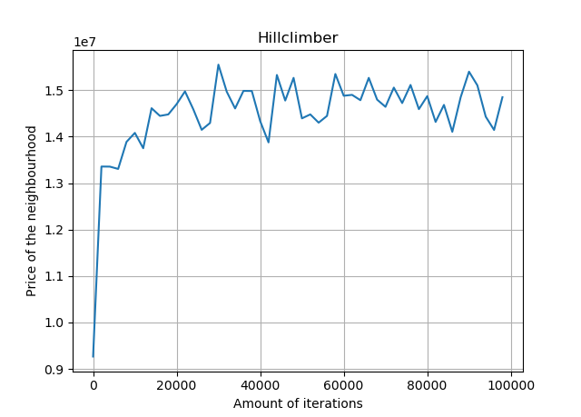

In dit wordt elk algoritme verder uitgelegd en worden de gekozen parameters toegelicht.

### Random
In het random algoritme worden de huizen doormiddel van random gegenereerde x,ycoordinaten geplaats op de kaart. Een huis wordt echter alleen geplaatst als er geen overlap is met een ander huis of met het water. Als er wel overlap is wordt er een nieuw coördinaat gegenereerd. Na een aantal iteraties te hebben uitgevoerd wordt de wijk met de hoogste score opgeslagen.

### Greedy
Het greedy algoritme plaats de huizen naar afnemende waarde: maison, bungalow, ééngezinswoning. In dit algoritme worden de huizen 1 voor 1 geplaatst. Er wordt voor elk huis naar alle beschikbare x,y-coordinaten gekeken welke plek het meest oplevert. Op deze plek wordt het huis dan uiteindelijk geplaats.

### Random + Greedy
Het random greedy algoritme plaats huizen één voor één op een random locatie waarna het huis verplaatst wordt naar 400 verschillende locaties en het het huis uiteindelijk geplaatst wordt op de locatie die de hoogste waarde oplevert. De huizen worden verder geplaatst van meest waardevol naar minst waardevol (maison, bungalow en eengezinswoning).

### Random Water
Bij het creëren van een wijk met random water wordt er een getal tussen de 1 en 4 gekozen die bepaalt hoeveel waterlichamen er worden geplaatst. Er wordt dan een functie aangeroepen die bepaalt hoeveel procent van de totale oppervlakte elk waterlichaam mag innemen. Er worden dan random x,y-coordinaten gecreëerd waar de hoogte-breedteverhoudingen tussen de 1 en de 4 liggen. Er wordt dan gekeken of er geen overlap is met een ander waterlichaam. Als dit niet het geval is wordt het water geplaatst op de kaart.

## Greedy Water

### Hillclimber 1
De eerste versie van hillclimber maakt gebruik van random plaatsing. Een random huis wordt geselecteerd en op een random valide plek gezet. Als deze plek de totale prijs hoger maakt, blijft het huis staan. Als de totale prijs lager wordt, wordt het huis teruggezet. Dit principe wordt herhaald voor 20000 iteraties. Na ongeveer 20000 iteraties convergeert de prijs zoals ook te zien is in de grafiek. Minimale winst kan nog gehaald worden door het aantal iteraties te verhogen, maar deze tijd kan veel beter gebruikt worden om het algoritme meerdere keren te herhalen. In de grafiek is namelijk ook te zien dat de prijs per iteratie erg varieert, wat aantoont dat de uiteindelijke prijs sterk afhankelijk is van de initiele plaatsing van de huizen.

 

### Hillclimber 2

### Hillclimber 3

### Simulated annealing
Het simulated annealing algoritme kan uitgevoerd worden met hillclimber1, hillclimber2 en hillclimber3. Het algoritme wordt normaal uitgevoerd, maar in plaats van alleen bij een hogere prijs de verandering te accepteren, wordt een negatieve verandering ook geaccepteerd met een bepaalde kans.

Deze kans wordt gegeven door de volgende formule:  
,

waar dE het prijsverschil is (new_price - old_price), en T de huidige temperatuur. 

### Genetic
